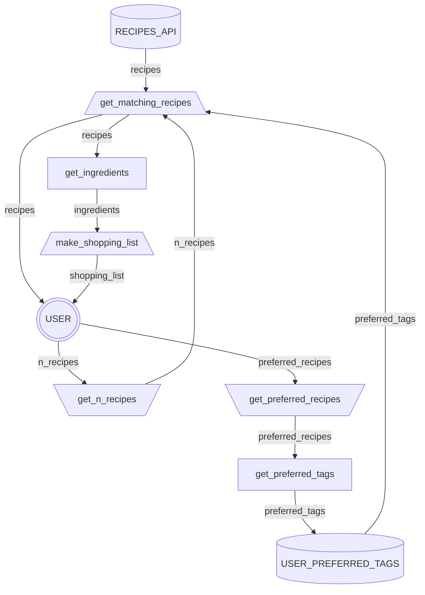

```mermaid
flowchart TD

API[(RECIPES_API)]
USER(((USER)))
USER_PREFERRED_TAGS[(USER_PREFERRED_TAGS)]
get_n_recipes[\get_n_recipes/]
get_matching_recipes[/get_matching_recipes\]
make_shopping_list[/make_shopping_list\]
get_preferred_recipes[\get_preferred_recipes/]

API --> |recipes| get_matching_recipes
USER --> |n_recipes| get_n_recipes
USER_PREFERRED_TAGS --> |preferred_tags| get_matching_recipes
get_n_recipes --> |n_recipes| get_matching_recipes
get_matching_recipes --> |recipes| get_ingredients
get_matching_recipes --> |recipes| USER
get_ingredients --> |ingredients| make_shopping_list
make_shopping_list --> |shopping_list| USER
USER --> |preferred_recipes| get_preferred_recipes
get_preferred_recipes --> |preferred_recipes| get_preferred_tags
get_preferred_tags --> |preferred_tags| USER_PREFERRED_TAGS
```