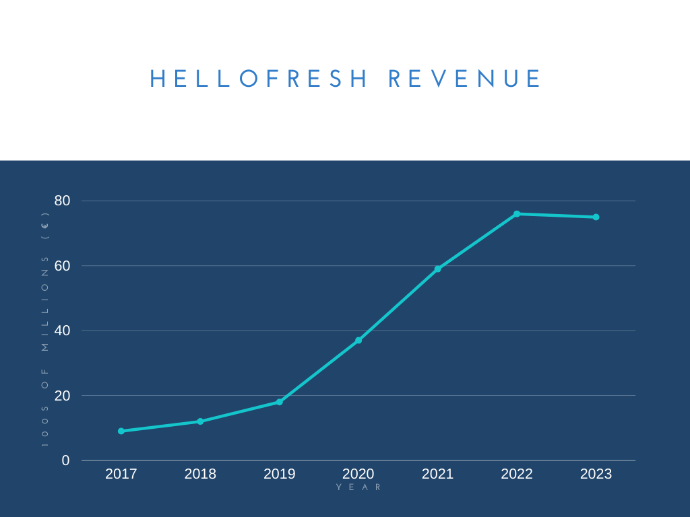

- [1. Project Objective](#1-project-objective)
  - [1.1 Name](#11-name)
  - [1.2 Project title](#12-project-title)
  - [1.3 Project objective](#13-project-objective)
- [2. Research Summary](#2-research-summary)
  - [2.1 Existing examples](#21-existing-examples)
    - [groceri.es](#groceries)
    - [AI Meal Planner](#ai-meal-planner)
    - [Fresh Prep](#fresh-prep)
  - [2.2 Relevant vocabulary](#22-relevant-vocabulary)
  - [2.3 Relevant concepts](#23-relevant-concepts)
    - [Object-oriented programming](#object-oriented-programming)
    - [Procedural programming](#procedural-programming)
    - [Functional programming](#functional-programming)

# 1. Project Objective

## 1.1 Name

Kian Khadempour

## 1.2 Project title

Meal Planner

## 1.3 Project objective

The objective of this project is to provide a more eco- and wallet-friendly alternative to meal-kit delivery services such as [HelloFresh](https://www.hellofresh.ca/) or [FreshPrep](https://www.freshprep.ca/). The project will accomplish this by automatically fetching recipes and creating a shopping list for the user. When the user is finished with their recipes, they may give feedback on the recipes to tailor future recipes to their tastes.

---

In the past decade, meal-kit delivery services have exploded. Here is a chart showing the biggest meal-kit company's revenue growth since 2017 ("HelloFresh Fundamentalanalyse"):

Despite this growth and their claims of eco-friendliness, their use of hundreds of thousands of tons of unrecyclable freezer gel has raised concerns over the environmental impacts of the services (Butler). In addition, buying ready-made kits is more expensive in the long run when compared to buying your own groceries from a grocery store (assuming you don't waste money on expensive products). For these reasons, I decided to make this project.

# 2. Research Summary

## 2.1 Existing examples

### groceri.es

[groceri.es](https://github.com/juriansluiman/groceri.es) is a project that is very similar to what I plan to make. It allows users to plan out their recipes for a week and generates shopping lists automatically. The difference between the projects is that my meal planner will automatically pick recipes to save the hassle of meal planning yourself by using feedback to tailor itself to the user's tastes. Similarities include the shopping list generator and the planning aspect.

### AI Meal Planner

[AI Meal Planner](https://ai-meal-planner.streamlit.app/) is a web app with a different goal than mine, but the end result is somewhat similar. Instead of fetching real recipes from an API, AI Meal Planner automatically generates them using a chatbot. It maximises the amount of calories and nutrition possible by selecting specific ingredients and then gets the AI to make a recipe using those ingredients. Differences from my project include not having a shopping list generator and not using real recipes. It does select recipes for the user automatically, which is similar to my project.

### Fresh Prep

[Fresh Prep](https://www.freshprep.ca/) is a meal planning service that is the reason I am making this project. It automatically picks recipes that it thinks the user would like and allows them to choose from a selection. It then prepares some of the ingredients and sends all of them pre-packaged to the user's house. Differences include actually shipping the food, while my project gets you to buy it from the store yourself, and preparing some of the ingredients already. Similarities include automatic recipe selection and customizable amounts of meals per week.

## 2.2 Relevant vocabulary

- ingredient
  - something you can buy in a store that is included in the recipe
- recipe
  - a list of instructions on how to prepare and cook a meal
- serving
  - the amount of food required for one person
- shopping list
  - a list of ingredients and amounts of those ingredients to buy from the grocery store

## 2.3 Relevant concepts

### Object-oriented programming

Object-oriented programming (OOP) is a style of programming where all data is structured in objects, which also contain methods to act on that data. While I will be using some concepts from OOP, I will not structure my entire project as OOP.

### Procedural programming

Procedural programming is a style of programming where the program is a single function that calls other functions in order. Procedural programming makes the most sense to me because it is simple to think about the exact steps needed to complete a task and then program them in individually. This is how I plan to structure my project for the most part.

### Functional programming

Functional programming (FP) is a style of programming where a program is composed of functions, similarily to procedural programming. In contrast to procedural programming, though, each function is pure, meaning for a given input it will always output the same thing. While I plan to make most of my functions pure, as it reduces headaches later on, I cannot make all of them pure as using real-world APIs introduces uncertainty that makes any function interacting with them unpure.

